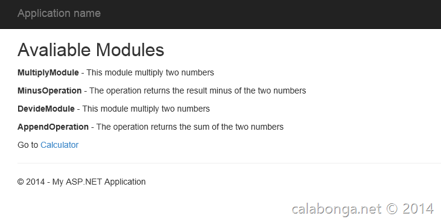

# Описание
Проект является приложением к статье "[ASP.NET MVC: Плагины для ASP.NET MVC или Autofac Modules как plugins](/blog/post/asp-net-mvc-plaginy-dlya-ili-autofac-modules-kak-plugins)" 

# Вступление
Модульные приложения - это хорошо масштабируемые приложения, которые достаточно просто поддаются расширению, то есть добавлению нового функционала. В этой статье описывается один из примеров организации модульного приложения на основе DI-контейнера Autofac.

Целью моей статьи показать, как можно организовать структуру приложения, в котором реализованы обособленные модули (плагины). Примером для такой реализации я взял принцип калькулятора с удаленными операциями. Представьте, что у вас есть разборный калькулятор, у которого кнопки операций (+,-, и т.д.) находятся в другой коробке. Какие кнопки вставите в корпус, такие операции можно выполнять. Для реализации задачи потребуется Visual Studio 2013 или Visual Studio 2012 c установленным пакетом обновления (Update 2013.1). Хотя на самом деле для реализации можно взять и другую версию ASP.NET MVC, не обязательно пятую версию.

# Архитектура решения
На этот раз сначала создадим чистое решение (blank solution). Для этого надо нажать "Новый проект (New Project)", далее на закладке слева выбрать "Installed -> Other Project Types -> Visual Studio Solution". Вводим название для нашего решения “ModulesMvc”. После этого нажать кнопку "Ok". Теперь во вновь созданное решениедобавим первый проект. Правой кнопкой на решении, затем "добавить новый проект (New Project)". Создаем новое приложение из шаблона ASP.NET MVC 5.

Не лишним было бы запустить в Package Manager Console команду upadate-package, чтобы обновить все сборки (в том числе и сами ASP.NET MVC). После этого добавляем в решение новый проект. Тип этого проекта Class Library. Название для в моем случае будет “ModulesContracts”. Этот проект будет содержать все необходимые интерфейсы и базовые классы для “передачи” их во внешние модули. Этот проект, так сказать, является “корневым” по части зависимостей в архитектуре решения (solution).

# Снимки с экрана

